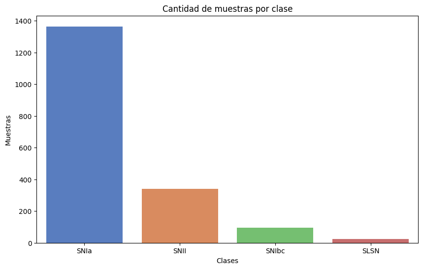
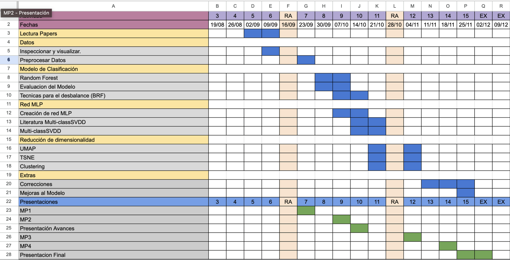
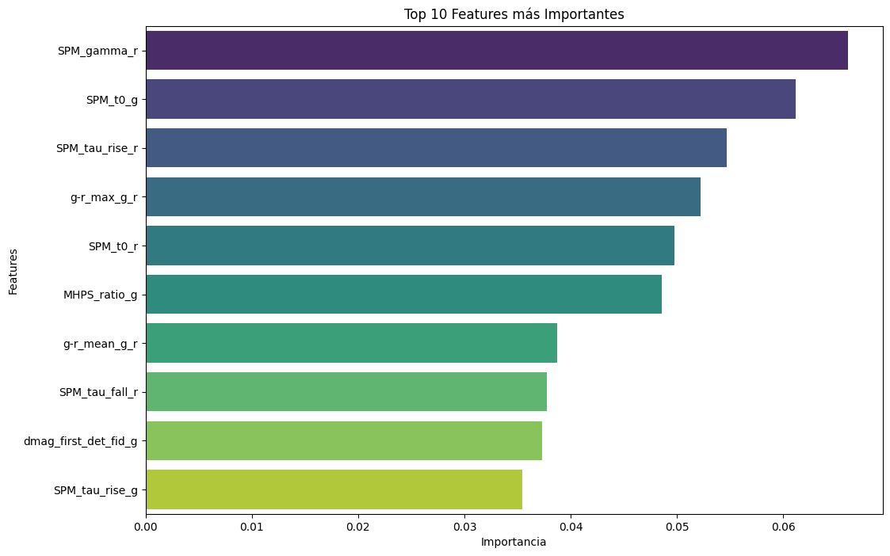
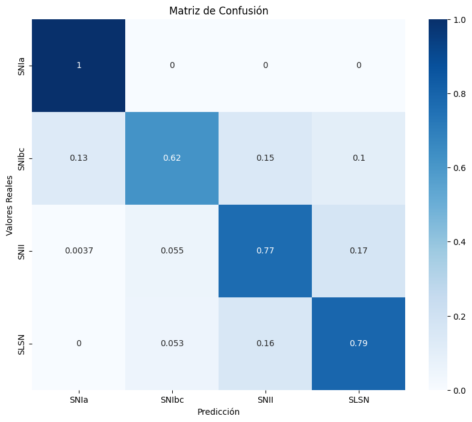
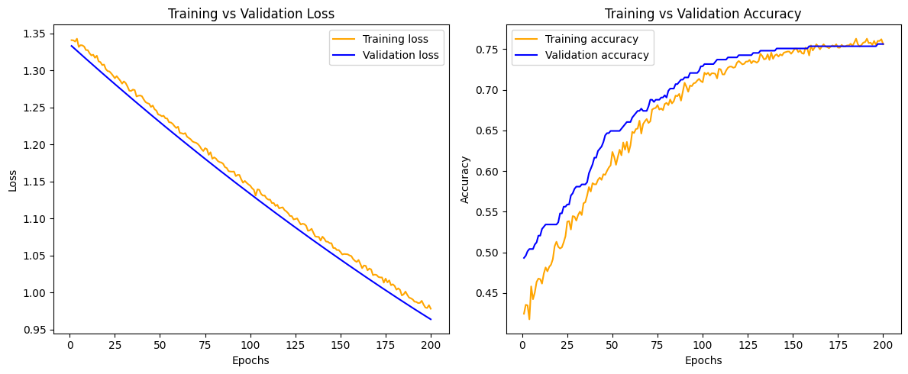
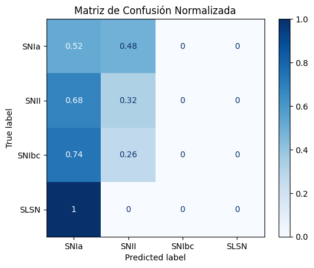

Para completar el README siguiendo la estructura sugerida, aquí tienes una guía para cada sección:

### 1. Título y Autores
   - **Título del proyecto**: Clasificación de Supernovas usando Machine Learning.
   - **Autores**: Daryl Clerc, José Luis Espinoza.

### 2. Descripción del problema a abordar, motivación
   - **Descripción**: El proyecto se centra en la clasificación automática de supernovas a partir de sus curvas de luz, enfrentando desafíos como el desbalance de clases.
   - **Motivación**: Facilitar la identificación de eventos astronómicos en grandes volúmenes de datos, ayudando a los astrónomos a priorizar observaciones y entender mejor fenómenos cósmicos.

### 3. Objetivos del proyecto
   - **Objetivo principal**: Desarrollar un modelo supervisado que clasifique supernovas a partir de sus curvas de luz.
   - **Objetivos específicos**: Incluye preprocesamiento de datos, manejo del desbalance de clases, desarrollo y evaluación de modelos, y análisis de la importancia de features.

### 4. Base de datos
   - **Datos a usar**: Este proyecto utiliza curvas de luz obtenidas del **Zwicky Transient Facility (ZTF)**, que incluyen diferentes tipos de supernovas: **SNIa**, **SNII**, **SNIbc**, y **SLSN**.
   
   #### Distribución de elementos por clase
      A continuación, se muestra la distribución de muestras por cada tipo de supernova en el conjunto de datos utilizado.
      
      | Clase     | Cantidad de Muestras |
      |-----------|-----------------------|
      | **SNIa**  | 1364                 |
      | **SNII**  | 339                  |
      | **SNIbc** | 96                   |
      | **SLSN**  | 24                   |
      | **Número total de muestras** | 1823 |

### 5. Pre-procesamiento de datos

- **Pasos**:
   1. **Inspección y limpieza de datos**: Se revisan los datos para identificar y eliminar valores atípicos o inconsistencias que puedan afectar el rendimiento del modelo.
   2. **Normalización**: Se aplican técnicas de normalización para escalar las variables y asegurar que todos los datos estén en una misma escala, lo cual es crucial para modelos como el MLP.
   3. **Selección de variables**: Se realiza una selección de las features más importantes, utilizando las características clave identificadas en la literatura (según el paper de referencia) para garantizar que el modelo trabaje con las variables más relevantes.
   4. **Transformación de variables**: En algunos casos, se transforman las variables para mejorar la capacidad del modelo de identificar patrones en los datos.

 Este proceso de pre-procesamiento asegura que los datos sean representativos y facilita que el modelo pueda identificar los patrones importantes para la clasificación de supernovas.

### 6. Definición y justificación del tipo de algoritmo a usar

 - **Algoritmos**:
   1. **Balanced Random Forest**: Se utiliza este algoritmo para abordar el desbalance de clases presente en el conjunto de datos. El Balanced Random Forest aplica una estrategia de balanceo inherente que mejora la precisión en las clases minoritarias, evitando que el modelo se sesgue hacia las clases mayoritarias.
   
   2. **Multilayer Perceptron (MLP)**: Este modelo permite evaluar el rendimiento en un conjunto de datos sin técnicas explícitas de balanceo, proporcionando una comparación del desempeño en condiciones de desbalance. El MLP es especialmente útil para capturar patrones complejos debido a su estructura de capas.

   3. **Multiclass Support Vector Data Description (SVDD)**: Finalmente, se planea implementar una versión multiclass del algoritmo SVDD para realizar una clasificación más precisa y robusta en múltiples categorías. Este enfoque es adecuado para detectar y clasificar múltiples clases en problemas donde la detección de anomalías puede mejorar la identificación de clases minoritarias.

 Cada algoritmo se selecciona y justifica con base en sus ventajas para enfrentar el desbalance de clases y su capacidad para capturar patrones en las curvas de luz, facilitando una clasificación más precisa de las supernovas.

### 7. Definición de salidas deseadas, función objetivo, y principio de optimización

  - **Salida deseada**: El objetivo principal es lograr una clasificación precisa de las supernovas en sus tipos correspondientes (SNIa, SNII, SNIbc, SLSN). Se busca que el modelo pueda identificar correctamente tanto las clases mayoritarias como las minoritarias en el conjunto de datos.

  - **Función objetivo**: La función objetivo se centra en maximizar la **precisión** y la **Balanced Accuracy** del modelo. La precisión es importante para asegurar que el modelo clasifique correctamente las observaciones, mientras que la Balanced Accuracy ayuda a evaluar el rendimiento del modelo considerando el desbalance entre clases.

  - **Principio de optimización**: Se aplican técnicas de optimización para minimizar la pérdida de clasificación. Este enfoque ayuda a que el modelo aprenda a distinguir correctamente entre las diferentes clases de supernovas, reduciendo los errores de clasificación y mejorando el rendimiento global del sistema.

### 8. Criterio de detención del algoritmo y parámetros por definir
   #### Balanced Random Forest
   - **Criterio de detención**: Se define un límite de precisión para detener el entrenamiento una vez que el modelo alcanza un rendimiento satisfactorio.
   - **Parámetros**: Incluyen el número de árboles en el bosque y la asignación de pesos para enfrentar el desbalance de clases.
   #### MLP 
   - **Criterio de detención**: Número máximo de épocas, configurado para evitar el sobreentrenamiento y optimizar el tiempo de entrenamiento.
   - **Parámetros**: Tasa de aprendizaje y tamaño de las capas ocultas, además de otros hiperparámetros ajustados para mejorar el rendimiento en clases minoritarias.

### 9. Software
   - **Librerías y lenguaje**: Implementación en Python con uso de librerías como **scikit-learn**, **tensorflow** y **pandas** para manejo de datos y modelado.

### 10. Resultados esperados
   - **Medidas de desempeño**: Precisión, Balanced Accuracy, Macro Precision, Macro Recall y F1 Score.
   - **Presentación de resultados**: Tablas de métricas y gráficos de importancia de características, curvas de entrenamiento y matrices de confusión.

### 11. Estimación de recursos computacionales
   - **Recursos necesarios**: Para el modelo **Balanced Random Forest**, el consumo de recursos es mínimo y no fue necesario utilizar GPU, ya que el modelo es eficiente en términos de tiempo y procesamiento. Sin embargo, para el modelo **MLP**, se está utilizando una GPU debido a que los entrenamientos son más demandantes y requieren mayor capacidad de procesamiento para lograr un rendimiento adecuado.

### 12. Carta GANTT semanal de pasos a seguir
   - **Planificación**: Esquema semana a semana, de actividades desde la preparación de datos, preprocesamiento, implementación de modelos, evaluación, hasta la presentación final.
   

### 13. Referencias
   1. Sánchez-Sáez, P., et al. "Alert Classification for the ALeRCE Broker System: The Light Curve Classifier." *arXiv preprint*, arXiv:2008.03311, 2020. Disponible en: [https://arxiv.org/abs/2008.03311](https://arxiv.org/abs/2008.03311)
   
   2. Förster, F., et al. "The Automatic Learning for the Rapid Classification of Events (ALeRCE) Alert Broker." *arXiv preprint*, arXiv:2008.03303, 2020. Página web de ALeRCE: [ALeRCE ZTF Explorer](https://alerce.online)
   
   3. Perez-Carrasco, M., Cabrera-Vives, G., Hernández-García, L., Förster, F., Sanchez-Saez, P., et al. "Alert classification for the alerce broker system: The anomaly detector." *The Astronomical Journal*, vol. 166, p. 151, sep 2023. Disponible en: [https://doi.org/10.3847/1538-3881/ac240d](https://doi.org/10.3847/1538-3881/ac240d)
   
   4. McInnes, L., & Healy, J. "UMAP: Uniform Manifold Approximation and Projection for Dimension Reduction." *ArXiv e-prints*, arXiv:1802.03426, 2018. Documentación UMAP: [https://umap-learn.readthedocs.io/](https://umap-learn.readthedocs.io/)
   
   5. Van der Maaten, L., & Hinton, G. "Visualizing data using t-SNE." *Journal of Machine Learning Research*, vol. 9, no. 11, 2008. Disponible en: [http://www.jmlr.org/papers/v9/vandermaaten08a.html](http://www.jmlr.org/papers/v9/vandermaaten08a.html)

### 14. Resultados preliminares

En esta sección, se presentan los resultados obtenidos para el modelo **Balanced Random Forest**, que ha mostrado el mejor desempeño, y el modelo **MLP**.

#### Balanced Random Forest

A continuación, se comparan las métricas obtenidas con nuestro modelo **Balanced Random Forest**.

| Métrica           | Valor          |
|-------------------|----------------|
| Accuracy          | 0.7452         |
| Balanced Accuracy | 0.7941         |
| Macro Precision   | 0.5541         |
| Macro Recall      | 0.7941         |
| Macro F1          | 0.5886         |

**Características más importantes del modelo**

**Matriz de Confusión**

A continuación, se presenta la matriz de confusión obtenida con nuestro modelo y la matriz de confusión reportada en el paper para analizar el rendimiento en la clasificación de las diferentes clases.

- **Matriz de confusión de nuestro modelo:**

  

#### Resultados preliminares del modelo MLP

A continuación, se presentan los resultados obtenidos para el modelo **Multilayer Perceptron (MLP)**.

| Métrica           | Valor          |
|-------------------|----------------|
| Accuracy          | 0.8164         |
| Balanced Accuracy | 0.3502         |
| Macro Precision   | 0.4098         |
| Macro Recall      | 0.3502         |
| Macro F1          | 0.3608         |

**Curvas de entrenamiento**

Las curvas de entrenamiento para el modelo MLP se presentan a continuación, mostrando la evolución de la pérdida y la precisión tanto en el conjunto de entrenamiento como en el de validación.

**Matriz de Confusión para el MLP**

La matriz de confusión para el modelo MLP se muestra a continuación:

