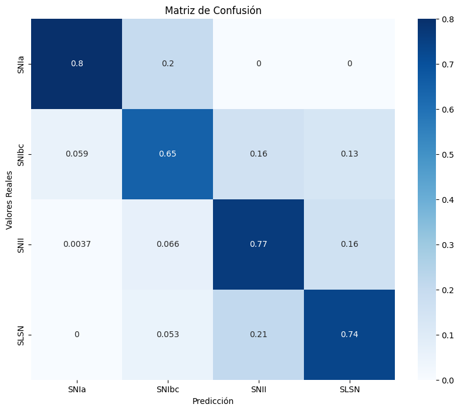
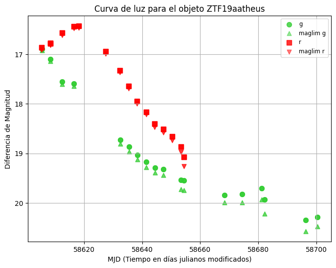

## 1. Título y Autores
   - **Título del proyecto**: Clasificación de Supernovas usando Machine Learning.
   - **Autores**: Daryl Clerc, José Luis Espinoza.

## 2. Descripción del Problema y Motivación

### Descripción
El proyecto se centra en la clasificación automática de supernovas a partir de sus curvas de luz, enfrentando desafíos como el desbalance de clases y el estudio de posibles anomalías.

### Motivación
Facilitar la identificación de eventos astronómicos en grandes volúmenes de datos, ayudando a los astrónomos a priorizar observaciones y entender mejor fenómenos cósmicos. Además, se busca la posible detección de eventos astronómicos no descubiertos previamente, incluyendo anomalías que podrían ser de gran interés científico.

## 3. Objetivos del Proyecto

### Objetivo Principal
Desarrollar un modelo supervisado que clasifique supernovas a partir de sus curvas de luz, además de un modelo capaz de detectar anomalías.

### Objetivos Específicos
1. Preprocesar y limpiar los datos.
2. Abordar el desbalance de clases en el conjunto de datos.
3. Desarrollar y evaluar modelos de clasificación.
4. Analizar la importancia de las características en los modelos.
5. Implementar técnicas de reducción de dimensionalidad como UMAP y t-SNE.
6. Entrenar y comparar modelos de clasificación y detección de anomalías.

## 4. Base de datos
- **Datos a usar**: Este proyecto utiliza curvas de luz obtenidas del **Zwicky Transient Facility (ZTF)**, que incluyen diferentes tipos de supernovas: **SNIa**, **SNII**, **SNIbc**, y **SLSN**.

### Distribución de elementos por clase
A continuación, se muestra la distribución de muestras por cada tipo de supernova en el conjunto de datos utilizado.

| Clase     | Cantidad de Muestras |
|-----------|-----------------------|
| **SNIa**  | 1364                 |
| **SNII**  | 339                  |
| **SNIbc** | 96                   |
| **SLSN**  | 24                   |
| **Número total de muestras** | 1823 |

## 5. Pre-procesamiento de datos

- **Pasos**:
   1. **Inspección y limpieza de datos**: Se revisan los datos para identificar y eliminar valores atípicos o inconsistencias que puedan afectar el rendimiento del modelo.
   2. **Selección de variables**: Se realiza una selección de las features más importantes, utilizando las características clave identificadas en la literatura (según el paper de referencia) para garantizar que el modelo trabaje con las variables más relevantes.
   3. **Transformación de variables**: En algunos casos, se transforman las variables para mejorar la capacidad del modelo de identificar patrones en los datos.

 Este proceso de pre-procesamiento asegura que los datos sean representativos y facilita que el modelo pueda identificar los patrones importantes para la clasificación de supernovas.

## 6. Definición y justificación del tipo de algoritmo a usar

- **Algoritmos**:

  1. **Balanced Random Forest**:  
     Se utiliza este algoritmo para abordar el desbalance de clases presente en el conjunto de datos. El Balanced Random Forest aplica una estrategia de balanceo inherente que mejora la precisión en las clases minoritarias, evitando que el modelo se sesgue hacia las clases mayoritarias.
   
  2. **Multilayer Perceptron (MLP)**:  
     Este modelo se utiliza para evaluar el rendimiento en un conjunto de datos desbalanceado, ofreciendo una comparación efectiva del desempeño en diferentes escenarios. El MLP es particularmente útil para capturar patrones complejos gracias a su arquitectura de capas ocultas. Además, está diseñado para generar un espacio latente que será aprovechado en el algoritmo MCSVDD para tareas posteriores de clasificación y detección de anomalías.

  3. **Multiclass Support Vector Data Description (SVDD)**:  
     Este enfoque multicategoría se implementa para lograr una clasificación más precisa y robusta en problemas con múltiples clases, al tiempo que permite la detección de anomalías. Este método es especialmente adecuado para identificar y clasificar clases minoritarias, mejorando la comprensión de los datos mediante la detección de puntos fuera de lo común. Los resultados se visualizan utilizando técnicas de reducción de dimensionalidad como t-SNE y UMAP, lo que facilita la interpretación de los clusters generados.

Cada algoritmo se selecciona y justifica con base en sus ventajas para enfrentar el desbalance de clases y su capacidad para capturar patrones en las curvas de luz, facilitando una clasificación más precisa de las supernovas.

## 7. Definición de salidas deseadas, función objetivo, y principio de optimización

- **Salida deseada**:  
  El objetivo principal es lograr una clasificación precisa de las supernovas en sus tipos correspondientes (SNIa, SNII, SNIbc, SLSN). Se busca que el modelo identifique correctamente tanto las clases mayoritarias como las minoritarias, garantizando una representación balanceada de todas las categorías. En el caso de anomalías, el modelo debe detectar puntos atípicos, es decir, curvas de luz que, al ser visualizadas, muestren características significativamente diferentes respecto a las curvas típicas de sus respectivas clases.

- **Función objetivo**:  
  La función objetivo del modelo se centra en maximizar la **precisión** y la **Balanced Accuracy**. La precisión asegura que el modelo clasifique correctamente las observaciones dentro de cada clase, mientras que la Balanced Accuracy evalúa el rendimiento teniendo en cuenta el desbalance entre clases, proporcionando una métrica más representativa para este tipo de datos.

- **Principio de optimización**:  
  Se implementan técnicas de optimización enfocadas en minimizar la pérdida de clasificación, lo que permite que el modelo distinga de manera efectiva entre las diferentes clases de supernovas. Este enfoque reduce los errores en la predicción y mejora el rendimiento global del sistema, asegurando una mayor robustez tanto en la clasificación de supernovas como en la detección de anomalías.

## 8. Criterio de detención del algoritmo y parámetros por definir

### Balanced Random Forest
- **Criterio de detención**:  
  Se define un límite de precisión para detener el entrenamiento una vez que el modelo alcanza un rendimiento satisfactorio en métricas clave como precisión y Balanced Accuracy.

- **Parámetros**:  
  Incluyen el número de árboles en el bosque, la profundidad máxima de los mismos, y la asignación de pesos para manejar el desbalance de clases de manera efectiva.

### Multilayer Perceptron (MLP)
- **Criterio de detención**:  
  Se configura un número máximo de épocas para evitar el sobreentrenamiento, acompañado de un monitoreo continuo de las métricas en el conjunto de validación. Además, se define un criterio basado en la mejora mínima de la pérdida en sucesivas iteraciones.

- **Parámetros**:  
  - Tasa de aprendizaje adaptativa.  
  - Número y tamaño de las capas ocultas.  
  - Tasa de dropout para regularización.  
  - Batch size y función de activación.  

### Multiclass Deep SVDD
- **Criterio de detención**:  
  Este modelo utiliza un enfoque iterativo basado en dos etapas principales:  
  1. **Clasificación (CLS Loss)**: Entrenamiento inicial para aproximar las observaciones a sus respectivos clusters.  
  2. **Optimización de centros y pérdida (Center Loss)**: Ajuste fino de los clusters, minimizando la distancia de las observaciones al centro de sus clases.  
  Se establece un criterio de detención cuando las métricas de pérdida convergen o después de un número fijo de iteraciones.

- **Parámetros**:  
  - Inicialización de los centros para cada clase.  
  - Peso de las pérdidas (CLS Loss y Center Loss).  
  - Estrategia de cálculo del puntaje de anomalía, basada en la distancia de las observaciones a sus respectivos centros.  
  - Técnicas de reducción de dimensionalidad (e.g., t-SNE, UMAP) para la visualización de clusters y análisis de resultados.

## 9. Software

- **Librerías y lenguaje**:  
  La implementación del proyecto se realiza en **Python**, utilizando un conjunto de librerías especializadas para el manejo de datos, modelado y visualización. Entre las principales librerías destacan:  
  - **scikit-learn**: Para preprocesamiento de datos, selección de características y modelado clásico.  
  - **PyTorch**: Para la implementación y entrenamiento de redes neuronales como el MLP y el algoritmo Multiclass Deep SVDD.  
  - **UMAP-learn** y **t-SNE**: Para técnicas avanzadas de reducción de dimensionalidad y análisis visual.  
  - **Pandas**: Para la manipulación eficiente de datos tabulares y series de tiempo.  
  - **Matplotlib** y **Seaborn**: Para la visualización de resultados, incluyendo las curvas de luz y representaciones en espacios latentes.  
  - **TensorFlow** (en caso necesario): Para pruebas o comparaciones en el modelado.

- **Aplicaciones específicas**:  
  - Visualización de curvas de luz para identificar patrones y anomalías.  
  - Representación visual de clusters generados a través de UMAP y t-SNE para interpretar la separación entre clases.

## 10. Resultados esperados

- **Medidas de desempeño**:  
  Se espera evaluar el rendimiento de los modelos utilizando las siguientes métricas clave:  
  - **Precisión**: Para medir la proporción de predicciones correctas en todas las clases.  
  - **Balanced Accuracy**: Para considerar el impacto del desbalance de clases en el rendimiento general.  
  - **Macro Precision** y **Macro Recall**: Para evaluar el desempeño por igual en todas las clases, sin importar su tamaño.  
  - **F1 Score**: Para balancear precisión y sensibilidad, especialmente útil en clases minoritarias.

- **Presentación de resultados**:  
  Los resultados se presentarán de forma clara y comprensible mediante:  
  - Tablas que resuman las métricas de desempeño por modelo y clase.  
  - Gráficos de importancia de características para entender los atributos más relevantes en la clasificación.  
  - Curvas de entrenamiento que muestren la evolución de la pérdida y precisión en el conjunto de entrenamiento y validación.  
  - Matrices de confusión para analizar los errores de clasificación en cada clase.

- **Visualización de datos**:  
  - Se espera observar una **separación notable entre clases** en las representaciones en espacios latentes generadas mediante técnicas como t-SNE y UMAP, lo que evidenciará la capacidad del modelo para distinguir entre cada categoría de supernovas.  
  - En el caso de detección de anomalías, se espera que los **puntos anómalos** muestren características particulares y se ubiquen en posiciones alejadas de los clusters principales, destacando su diferencia respecto a los elementos típicos de sus clases.  

## 11. Estimación de recursos computacionales

- **Recursos necesarios**:  
  - **Balanced Random Forest**: Este modelo tiene un consumo de recursos computacionales mínimo. No requiere GPU, ya que su eficiencia en términos de tiempo y procesamiento es suficiente para manejar el conjunto de datos.  
  - **Multilayer Perceptron (MLP)**: El modelo MLP requiere una **GPU** para entrenamientos debido a su mayor demanda computacional. Esto se debe a la necesidad de procesar varias capas ocultas y manejar grandes volúmenes de datos en lotes durante el entrenamiento, asegurando un rendimiento óptimo.  
  - **Multiclass Deep SVDD**: Este modelo no es intensivo en recursos computacionales durante su entrenamiento básico. Sin embargo, algunas técnicas de reducción de dimensionalidad utilizadas para la visualización y análisis, como **UMAP** y **t-SNE**, pueden ser computacionalmente costosas. En particular, **UMAP** tiende a ser más eficiente que **t-SNE**, aunque el costo depende del tamaño y complejidad de los datos.  

Se recomienda disponer de un entorno con acceso a GPU para entrenamientos más rápidos y para optimizar el uso de técnicas avanzadas de reducción de dimensionalidad.

## 12. Carta GANTT semanal de pasos a seguir
   - **Planificación**: Esquema semana a semana, de actividades desde la preparación de datos, preprocesamiento, implementación de modelos, evaluación, hasta la presentación final.
   

## 13. Referencias
   1. Sánchez-Sáez, P., et al. "Alert Classification for the ALeRCE Broker System: The Light Curve Classifier." *arXiv preprint*, arXiv:2008.03311, 2020. Disponible en: [https://arxiv.org/abs/2008.03311](https://arxiv.org/abs/2008.03311)
   
   2. Förster, F., et al. "The Automatic Learning for the Rapid Classification of Events (ALeRCE) Alert Broker." *arXiv preprint*, arXiv:2008.03303, 2020. Página web de ALeRCE: [ALeRCE ZTF Explorer](https://alerce.online)
   
   3. Perez-Carrasco, M., Cabrera-Vives, G., Hernández-García, L., Förster, F., Sanchez-Saez, P., et al. "Alert classification for the alerce broker system: The anomaly detector." *The Astronomical Journal*, vol. 166, p. 151, sep 2023. Disponible en: [https://doi.org/10.3847/1538-3881/ac240d](https://doi.org/10.3847/1538-3881/ac240d)
   
   4. McInnes, L., & Healy, J. "UMAP: Uniform Manifold Approximation and Projection for Dimension Reduction." *ArXiv e-prints*, arXiv:1802.03426, 2018. Documentación UMAP: [https://umap-learn.readthedocs.io/](https://umap-learn.readthedocs.io/)
   
   5. Van der Maaten, L., & Hinton, G. "Visualizing data using t-SNE." *Journal of Machine Learning Research*, vol. 9, no. 11, 2008. Disponible en: [http://www.jmlr.org/papers/v9/vandermaaten08a.html](http://www.jmlr.org/papers/v9/vandermaaten08a.html)

## 14. Resultados preliminares

En esta sección, se presentan los resultados obtenidos para los modelos evaluados: **Balanced Random Forest**, **Multilayer Perceptron (MLP)** y **MCSVDD**.

---

### Balanced Random Forest

A continuación, se comparan las métricas obtenidas con el modelo **Balanced Random Forest**:

| Métrica           | Valor          |
|-------------------|----------------|
| Accuracy          | 0.7452         |
| Balanced Accuracy | 0.7941         |
| Macro Precision   | 0.5541         |
| Macro Recall      | 0.7941         |
| Macro F1          | 0.5886         |

**Características más importantes del modelo**  

**Matriz de Confusión**  
- **Matriz de confusión del modelo**:  
  

---

### Resultados preliminares del modelo MLP

A continuación, se presentan los resultados obtenidos para el modelo **Multilayer Perceptron (MLP)**:

| Métrica   | Valor   |
|-----------|---------|
| Accuracy  | 0.6027  |
| Precision | 0.8105  |
| Recall    | 0.6027  |
| F1 Score  | 0.6789  |

**Curvas de entrenamiento**  
Las curvas de entrenamiento muestran la evolución de la pérdida y precisión tanto en el conjunto de entrenamiento como en el de validación:  

**Matriz de Confusión**  
La matriz de confusión del modelo MLP se presenta a continuación:  

---

### Resultados preliminares del modelo MCSVDD

El modelo **MCSVDD** se evaluó inicialmente para clasificación y detección de anomalías. A continuación, se presentan las métricas obtenidas en el primer entrenamiento:

| Clase  | Precision | Recall | F1-Score | Soporte |
|--------|-----------|--------|----------|---------|
| SNIa   | 0.91      | 0.63   | 0.75     | 273     |
| SNII   | 0.74      | 0.66   | 0.70     | 68      |
| SNIbc  | 0.08      | 0.42   | 0.14     | 19      |
| SLSN   | 0.14      | 0.60   | 0.23     | 5       |

| **Métricas globales**  | **Valor** |
|------------------------|-----------|
| Accuracy               | 0.62      |
| Macro Average Precision| 0.47      |
| Macro Average Recall   | 0.58      |
| Macro Average F1       | 0.45      |

**Matriz de Confusión**  

---

**Representaciones en espacios latentes (t-SNE y UMAP)**  
- Reducción de dimensionalidad con **t-SNE** luego del primer entrenamiento:  
    
- Reducción de dimensionalidad con **t-SNE** luego del primer entrenamiento:   
     
     
   

- Reducción de dimensionalidad con **UMAP**:  
    
  

---

### Resultados de detección de anomalías

Se calcularon los puntajes de anomalía para cada clase, destacando los puntos más alejados de sus respectivos clusters.  

| Clase   | Cantidad de elementos | Puntaje mínimo | Puntaje máximo | Puntaje promedio |
|---------|------------------------|----------------|----------------|------------------|
| SNIa    | 273                   | 4.8280         | 19.3363        | 7.4219           |
| SNII    | 68                    | 5.4444         | 19.4925        | 8.8647           |
| SNIbc   | 19                    | 5.5860         | 19.3363        | 8.2421           |
| SLSN    | 5                     | 10.3401        | 18.8913        | 14.6998          |

**Visualización de anomalías**  
Los puntos más rojos representan las anomalías con puntajes más altos, indicando mayor distancia respecto a sus respectivos clusters:  
-   
-   
-   
- 

**Curvas de luz correspondientes a anomalías**  

- **SNIa**:  
    
    

- **SNII**:  
    
    

- **SNIbc**:  
    
    

- **SLSN**:  
    
  
